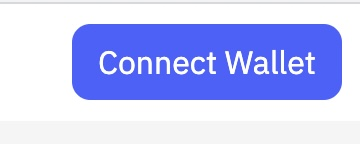
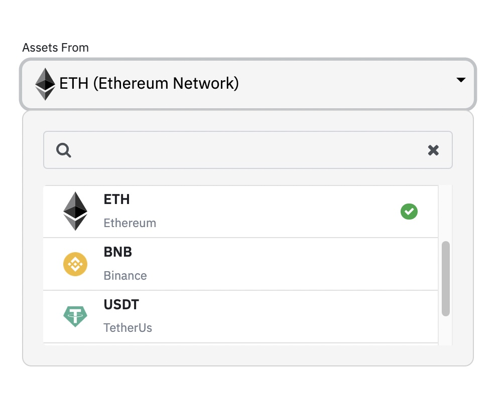

# Introduction
Access the Sardis bridge at:

https://bridge.sardisnetwork.com/

Contract Address：

Ethereum： [0x73A549B8bfB7aa52a3f8994B557f89124BeB2959](https://etherscan.io/address/0x73A549B8bfB7aa52a3f8994B557f89124BeB2959)

Sardis: [0xA375aD981F095fF84c4e6512988b80998acEb45d](https://contract-mainnet.sardisnetwork.com/address/0xA375aD981F095fF84c4e6512988b80998acEb45d/transactions)

# How it works

First connect your Metamask wallet to the bridge:

# Enter Sardis Network

Enter the Sardis Network using your crypto assets.

Currently we support ETH, USDT(ETH), BNB, USDT(BNB) 
The crypto asset list will grow to encompass other assets also in time.

Choose your asset of choice from the upper dropdown menu:

You will receive the corresponding amount of SRDX coins in accordance with the current price point of your asset at the time of the transaction. 
1 SRDX = 1 USD 

Note 1: You will not be able to use the Sardis Bridge without first having completed the KYC process and registered your Sardis Wallet address. 

Note 2: SRDX coins can only used inside the Sardis network to stake, become a validator or DEX usage.
