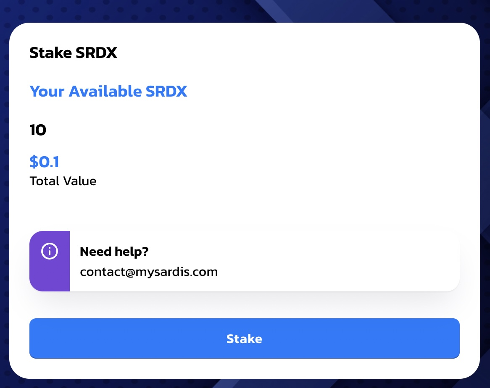
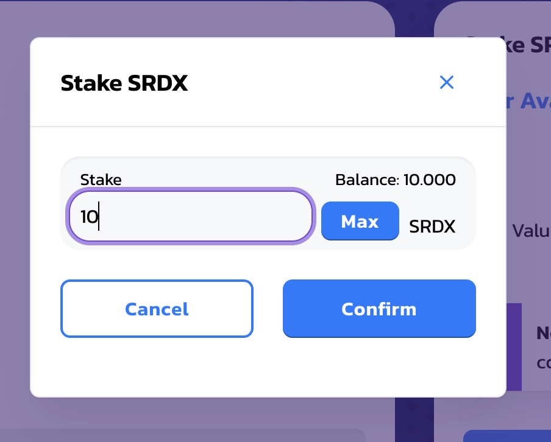

# Introduction

Access Sardis StakeDex at:

[https://stakedex.sardisnetwork.com/]

# How it works

First connect your Metamask wallet to the App using the upper right connect button:

# Stake some SRDX

Hit the "Stake" menu to access the staking page.  

Use the Stake pane to start staking  

Currently you can only stake SRDX. 

Type in the amount you wish to stake and hit confirm. 

When the transaction is complete your staking will start.  

Please note that a yearly earning of 15% SRDX is guaranteed with staking.
