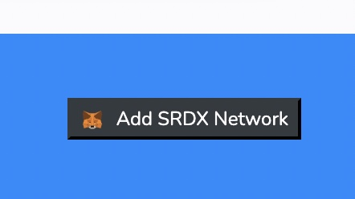
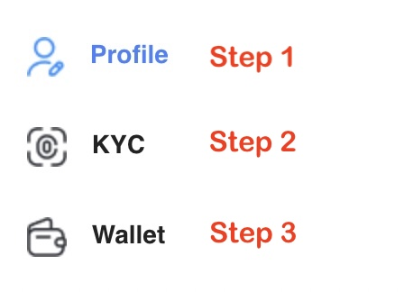
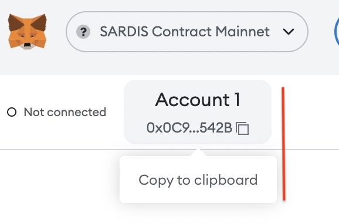

# Summary

Use metamask to enter the Sardis network. 
to
# metamask

download url：https://metamask.io/
Download metamask adding it as a browser extension.

You can add SRDX and SRDS networks to metamask by simply clicking on the Add Network button located on the footers of our explorers:
https://contract-mainnet.sardisnetwork.com/ and https://payment-mainnet.sardisnetwork.com/

Please use:

# Sardis KYC

Go to: 
https://kyc.sardisnetwork.com/

Step 1: Enter your profile information  
Step 2: Fill in the KYC form and apply for a KYC  
Step 3: After your KYC is approved copy your wallet address from metamask enter it in the Wallet form
 

